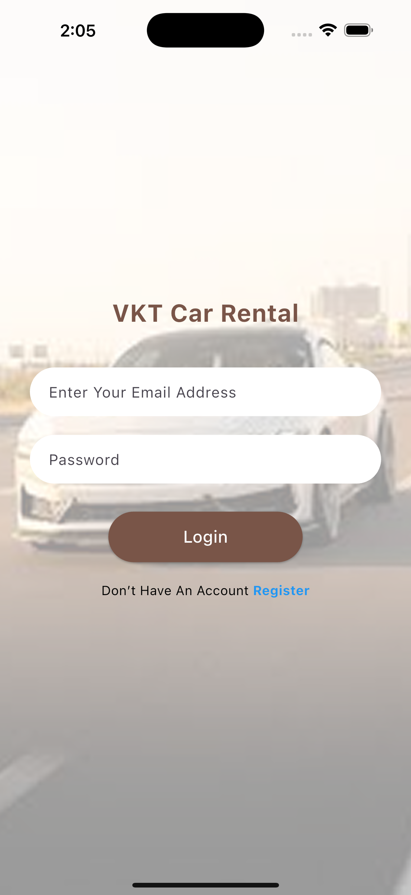
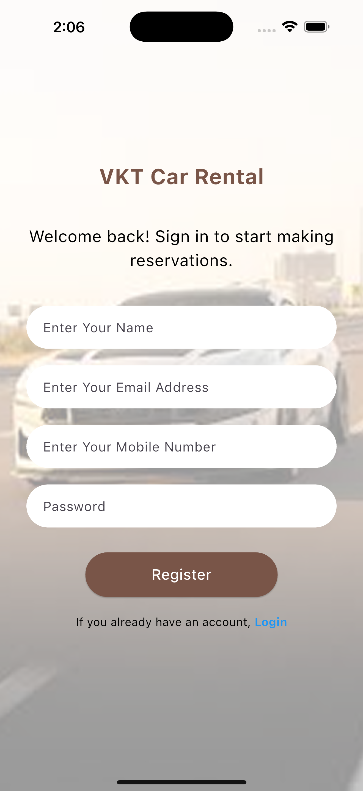
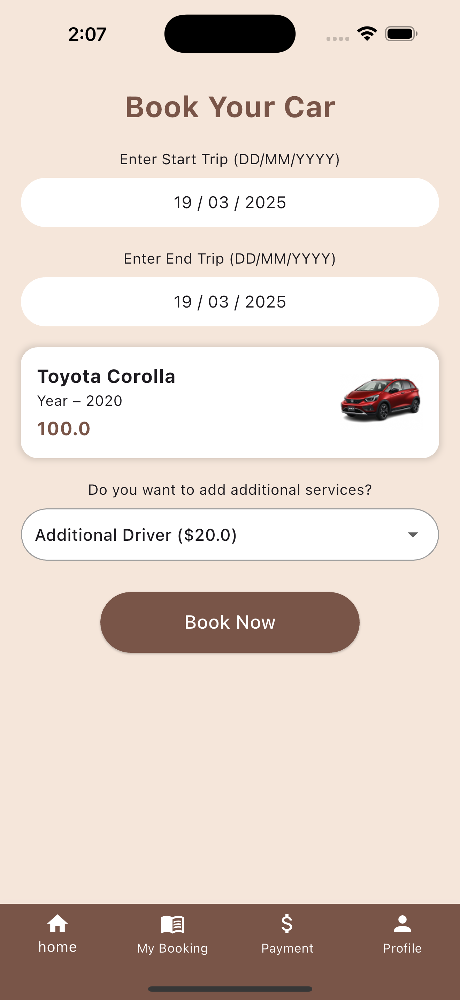
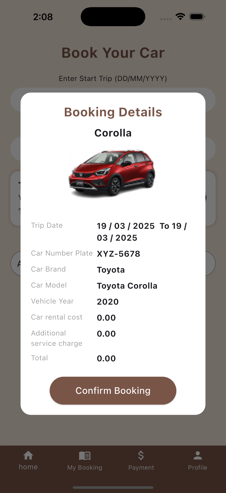
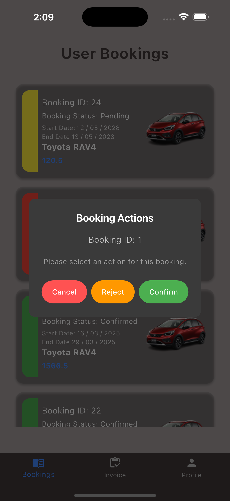

# Rental Car App

A Flutter-based car rental application with separate interfaces for customers and administrators, supporting multi-language localization (English and Māori).


## Features

### Customer Side
- **Authentication**:
  - Secure registration (Full Name, Email, Mobile, Password)
  - Login with email/password
  - Special admin login (admin@admin.com / admin)

- **Core Functionality**:
  - Car booking system with date picker
  - Additional service selection
  - Booking confirmation with detailed summary
  - Booking history tracking
  - Payment invoice management
  - Multi-language support (English/Māori)

- **User Interface**:
  - Home Tab: Browse available cars
  - My Bookings: View booking history
  - Payments: Track invoices and payment status
  - Profile: Manage account & language settings

### Admin Side
- **Management Features**:
  - View/Cancel/Confirm bookings
  - Track all user invoices
  - Manage booking statuses (Color-coded: Green=Confirmed, Red=Canceled, Yellow=Pending)
  - Automatic invoice emails on booking confirmation

- **Admin Interface**:
  - Bookings Tab: Manage all user bookings
  - Invoices Tab: Monitor payment statuses
  - Profile Tab: Admin details & language settings

## Installation

1. **Clone the repository**:
   ```bash
   https://github.com/thanushkaPraveen/MSE800_assessment_2.git
   cd MSE800_assessment_2
   ```

2. **Install dependencies**:
   ```bash
   flutter pub get
   ```

3. **Generate launcher icons**:
   ```bash
   flutter pub run flutter_launcher_icons:main
   ```

4. **Run the application**:
   ```bash
   flutter run
   ```

## Configuration

### Localization Setup
1. Add translation files in `assets/localization/`
2. Supported languages:
    - English (`en.json`)
    - Māori (`fr.json`)

To add new languages:
1. Create new JSON file in `assets/localization/`
2. Update language selection dropdown in profile pages

### Hive Database Setup
Generate TypeAdapters:
```bash
flutter packages pub run build_runner build
```

## Dependencies

Main packages used:
- **State Management**: `flutter_bloc`
- **API Handling**: `dio`, `http`
- **Local Storage**: `hive`, `hive_flutter`
- **Internationalization**: `intl`, `flutter_localizations`
- **Utilities**: `equatable`, `path_provider`

Full list in [pubspec.yaml](pubspec.yaml)

## Usage

### Customer Flow
1. Register new account
2. Login with credentials
3. Select dates and car from Home tab
4. Add optional services
5. Confirm booking
6. View bookings/payments in respective tabs
7. Manage profile & language settings

### Admin Flow
1. Login with admin credentials
2. Manage bookings from Bookings tab
3. Confirm bookings to generate invoices
4. Monitor payments in Invoices tab
5. Update admin profile & language

## Screenshots

| Welcome Screen | Login | Registration |
|----------------|-------|--------------|
|  |  |  |

| Home | Bookings | Admin View |
|------|----------|------------|
|  |  |  |

## Contributing

1. Fork the project
2. Create your feature branch (`git checkout -b feature/AmazingFeature`)
3. Commit changes (`git commit -m 'Add some AmazingFeature'`)
4. Push to branch (`git push origin feature/AmazingFeature`)
5. Open a Pull Request

## License

Distributed under the MIT License. See `\LICENSE` for more information.

## Acknowledgments

- Flutter community packages
- Localization best practices
- BLoC state management patterns
```
