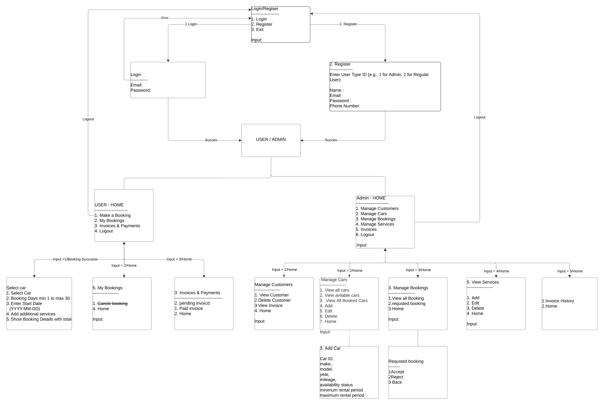
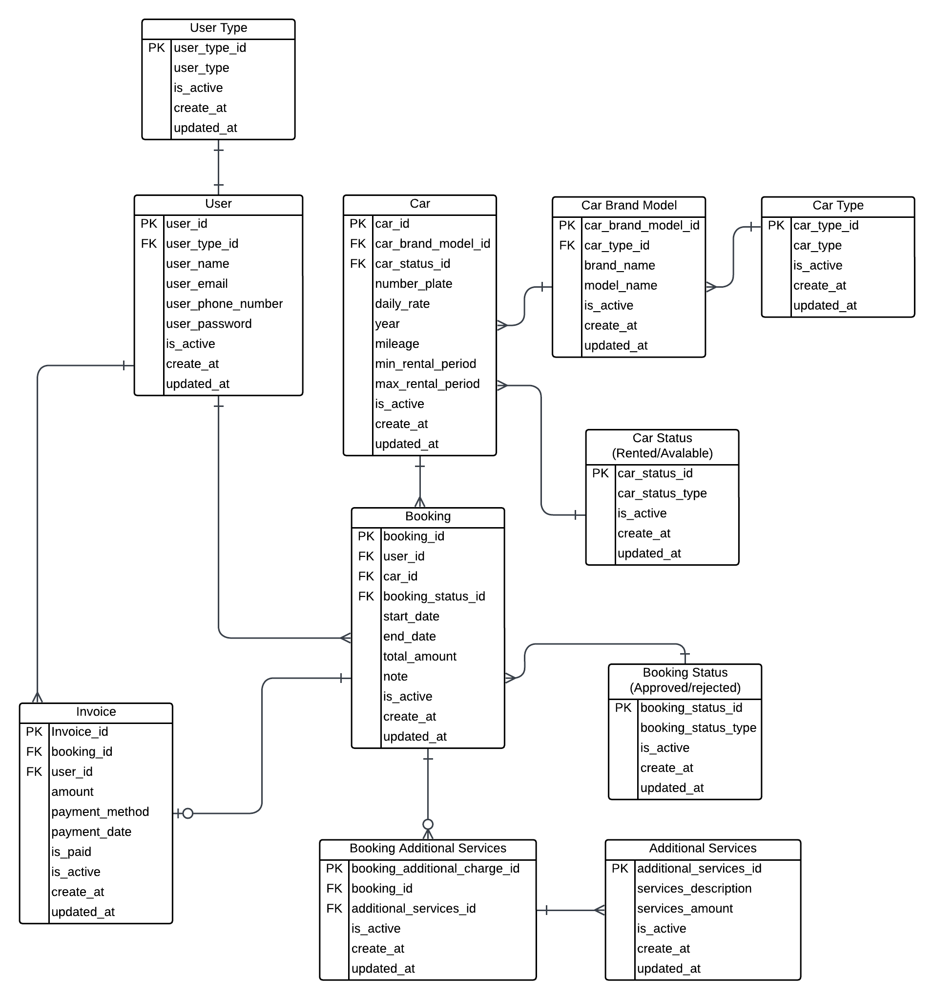

# README.md

## Car Rental System

### Project Overview

The Car Rental System automates the rental process for a fictional car rental company. By eliminating manual paperwork, it reduces errors and enhances customer satisfaction with a seamless digital experience.

### Key Objectives

- **Streamline rental management**
- **Enhance interaction between customers and administrators**
- **Provide innovative features to offer a competitive edge**

### System Workflow



---

## Features

### Admin Features

#### Manage Customers
- **View Customers:** Display details of all registered users.
- **Delete Customers:** Remove customer records from the system.
- **View Invoices:** Access invoice history for specific customers.

#### Manage Cars
- **View All Cars:** Display a list of all cars in the system.
- **View Available Cars:** Filter and display cars currently available for rent.
- **View Booked Cars:** Filter and display cars that are already booked.
- **Add Car:** Add a new car to the inventory with details (e.g., make, model, mileage, year, etc.).
- **Edit Car:** Update details of existing cars.
- **Delete Car:** Remove a car from the inventory.

#### Manage Bookings
- **View All Bookings:** Display a list of all customer bookings.
- **Approve/Reject Bookings:** Process pending booking requests.
- **Return to Home:** Navigate back to the main admin dashboard.

#### Manage Services
- **View All Services:** Display additional services offered.
- **Requested Services:** Review and manage services requested by customers.
- **Return to Home:** Navigate back to the main admin dashboard.

#### Invoices and Payments
- **View Invoices:** Access all generated invoices (both pending and paid).
- **Return to Home:** Navigate back to the main admin dashboard.

#### Logout
- **Secure Logout:** Safely log out of the system and navigate to the first page.

### User Features

#### User Login/Register
- Users can create an account or log in to access the system.

#### Make a Booking
- **View Cars:** Users can view all available cars.
- **Select Car:** Choose a car for booking.
- **Specify Rental Duration:** Enter a rental period within the admin-set date range (minimum 1 day, maximum 30 days).
- **Input Start Date:** Provide the booking start date (format: YYYY-MM-DD).
- **Add Services:** Include additional services to the booking.
- **Review Booking:** Confirm booking details and total cost before proceeding.

#### Booking History
- Users can access and review their previous bookings.

#### Manage Invoices
- **View Invoices:** Access pending invoices and complete payments.
- **Access Paid Invoices:** View past invoices for reference.

#### Logout
- **Secure Logout:** Safely log out of the system and navigate to the first page.

---

## Technologies Used

- **Programming Language:** Python
- **Database:** MySQL
- **IDE:** PyCharm CE
- **Libraries/Frameworks:**
  - `mysql-connector-python`: For database operations
  - `bcrypt`: For secure password hashing
  - `datetime`: For managing date and time fields
  - `tabulate`: For tabular data display in CLI

---

## System Requirements

- **Python:** 3.8 or higher
- **MySQL:** 8.0 or higher
- **IDE:** PyCharm CE or equivalent
- **Internet connection:** For downloading dependencies

---

## Installation Guide

Refer to the `setup_instructions.tex` file for detailed setup instructions.

---

## Usage Instructions

### Admin Usage

#### Login
- Enter admin credentials to access the dashboard.

#### Manage Customers
- View customer records, delete customers, or view their invoices.


#### Manage Cars
- Add, edit, delete cars, or view car statuses.


#### Manage Bookings
- Approve or reject booking requests.

#### View Invoices
- Track pending and paid invoices.

### Customer Usage

#### Register/Login
- New customers can register, while returning customers can log in to their accounts.

#### Book a Car
- Browse available cars, select the rental duration, and add additional services.


#### View Booking History
- Access previous booking details, including car information, dates, and rental history.

#### Pay Invoices
- Settle pending invoices securely through the payment interface.

---

## Database Structure

### Database Schema

#### UserType
**Purpose:** Defines roles for users, such as Admin and Customer.

**Columns:**
- `user_type_id` (Primary Key): Unique identifier for user types.
- `user_type`: Name of the user type.
- `is_active`: Indicates if the record is active (1 = Active, 0 = Inactive).
- `create_at` and `updated_at`: Timestamps for record creation and modification.

#### User
**Purpose:** Stores information about system users.

**Columns:**
- `user_id` (Primary Key): Unique identifier for users.
- `user_type_id` (Foreign Key): Links to `UserType(user_type_id)`.
- `user_name`, `user_email`, `user_phone_number`, `user_password`: User details.
- `is_active`: Indicates if the user is active (1 = Active, 0 = Inactive).
- `create_at` and `updated_at`: Timestamps for record creation and modification.

#### CarType
**Purpose:** Maintains categories of cars (e.g., Sedan, SUV).

**Columns:**
- `car_type_id` (Primary Key): Unique identifier for car types.
- `car_type`: Name of the car type.
- `is_active`: Indicates if the record is active.
- `create_at` and `updated_at`: Timestamps for record creation and modification.

#### CarBrandModel
**Purpose:** Stores brand and model details of cars.

**Columns:**
- `car_brand_model_id` (Primary Key): Unique identifier for brand and model entries.
- `car_type_id` (Foreign Key): Links to `CarType(car_type_id)`.
- `brand_name`, `model_name`: Details of car brands and models.
- `is_active`: Indicates if the record is active.
- `create_at` and `updated_at`: Timestamps for record creation and modification.

#### CarStatus
**Purpose:** Tracks the status of cars (e.g., Available, Rented).

**Columns:**
- `car_status_id` (Primary Key): Unique identifier for car statuses.
- `car_status_type`: Status type.
- `is_active`: Indicates if the record is active.
- `create_at` and `updated_at`: Timestamps for record creation and modification.

#### Car
**Purpose:** Stores car inventory information.

**Columns:**
- `car_id` (Primary Key): Unique identifier for cars.
- `car_brand_model_id` (Foreign Key): Links to `CarBrandModel(car_brand_model_id)`.
- `car_status_id` (Foreign Key): Links to `CarStatus(car_status_id)`.
- Other details: `number_plate`, `model_name`, `daily_rate`, `year`, `mileage`, `min_rental_period`, `max_rental_period`.
- `is_active`: Indicates if the record is active.
- `create_at` and `updated_at`: Timestamps for record creation and modification.

#### BookingStatus
**Purpose:** Tracks the status of bookings (e.g., Pending, Confirmed).

**Columns:**
- `booking_status_id` (Primary Key): Unique identifier for booking statuses.
- `booking_status_type`: Status type.
- `is_active`: Indicates if the record is active.
- `create_at` and `updated_at`: Timestamps for record creation and modification.

#### Booking
**Purpose:** Manages customer bookings.

**Columns:**
- `booking_id` (Primary Key): Unique identifier for bookings.
- `user_id` (Foreign Key): Links to `User(user_id)`.
- `car_id` (Foreign Key): Links to `Car(car_id)`.
- `booking_status_id` (Foreign Key): Links to `BookingStatus(booking_status_id)`.
- Other details: `start_date`, `end_date`, `total_amount`, `note`.
- `is_active`: Indicates if the record is active.
- `create_at` and `updated_at`: Timestamps for record creation and modification.

#### AdditionalServices
**Purpose:** Tracks optional services for bookings (e.g., GPS, child seat).

**Columns:**
- `additional_services_id` (Primary Key): Unique identifier for additional services.
- `services_description`, `services_amount`: Service details.
- `is_active`: Indicates if the record is active.
- `create_at` and `updated_at`: Timestamps for record creation and modification.

#### BookingAdditionalServices
**Purpose:** Links additional services to bookings.

**Columns:**
- `booking_additional_charge_id` (Primary Key): Unique identifier for booking additional charges.
- `booking_id` (Foreign Key): Links to `Booking(booking_id)`.
- `additional_services_id` (Foreign Key): Links to `AdditionalServices(additional_services_id)`.
- `is_active`: Indicates if the record is active.
- `create_at` and `updated_at`: Timestamps for record creation and modification.

#### Invoice
**Purpose:** Manages payment records.

**Columns:**
- `invoice_id` (Primary Key): Unique identifier for invoices.
- `booking_id` (Foreign Key): Links to `Booking(booking_id)`.
- `user_id` (Foreign Key): Links to `User(user_id)`.
- Other details: `amount`, `payment_method`, `payment_date`, `is_paid`.
- `is_active`: Indicates if the record is active.
- `create_at` and `updated_at`: Timestamps for record creation and modification.

### Entity Relationship Diagram



### Relationships Between Tables

- **Users ↔ Booking:** One user can have many bookings.
- **Cars ↔ Booking:** One car can have multiple bookings.
- **Booking ↔ Invoice:** Each booking can have one associated invoice.
- **Users ↔ Invoice:** One user can have multiple invoices.
- **UserType ↔ Users:** One user type can be associated with multiple users.
- **CarType ↔ CarBrandModel:** One car type can be associated with multiple car brands and models.
- **CarBrandModel ↔ Cars:** One car brand/model can have multiple cars.
- **CarStatus ↔ Cars:** One car status can be associated with multiple cars.
- **BookingStatus ↔ Booking:** One booking status can be associated with multiple bookings.
- **Booking ↔ BookingAdditionalServices:** One booking can have multiple additional services.
- **AdditionalServices ↔ BookingAdditionalServices:** One additional service can be associated with multiple bookings.

### Database Screenshots

**NOTE:** All database-related queries can be checked in the `sql_statement` file.

---

## Design Patterns

- **Factory Pattern:** Used for dynamically creating database connection instances.
- **Singleton Pattern:** Ensures that only one database connection instance exists at any given time.
- **Observer Pattern:** Facilitates notification of users about booking status changes (e.g., via email).

---

## Future Enhancements

- **AI-Powered Recommendations:** Suggest cars to users based on their preferences.
- **Mobile Integration:** Develop a Flutter-based mobile application.
- **Dynamic Pricing:** Implement surge pricing during high-demand periods.
- **Real-Time Notifications:** Use APIs for updates and reminders.
- **Dynamic Search:** Add filters for price range, car type, mileage, and availability.
- **Multi-language Support:** Offer a language selector.
- **Multi-currency Support:** Enable payments in different currencies.

---

## Testing and Debugging

### Testing

- **Integration Testing:** Ensures end-to-end workflows function correctly.
- **Manual Testing:** Verifies CLI functionality for various inputs.

### Debugging

- **Logging:** Use logging for database operations and exception handling.
- **Configuration Validation:** Validate configurations before deployment.

---

## Contributing

We welcome contributions to improve this project. Follow these steps to contribute:

1. **Fork the repository.**
2. **Create a feature branch:**
   ```bash
   git checkout -b feature-name
   ```
3. **Commit your changes:**
   ```bash
   git commit -m "Add feature-name"
   ```
4. **Push to the branch:**
   ```bash
   git push origin feature-name
   ```
5. **Open a Pull Request.**

---

## License

This project is licensed under the MIT License - see the [LICENSE](./LICENSE) file for details.

---

## Credits

- **Developer:** Thansushka Praveen Wickramarachchi
- **Contact:** [270599091@yoobeestudent.ac.nz](mailto:270599091@yoobeestudent.ac.nz)
- **GitHub:** [https://github.com/thanushkaPraveen](https://github.com/thanushkaPraveen)

---

## Acknowledgments

Special thanks to **Yoobee College** for guidance and resources in software development.


